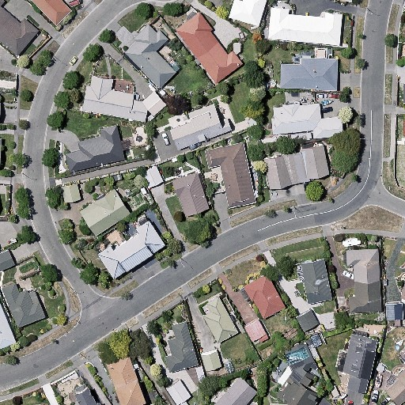
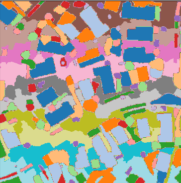

# SAM for Remote Sensing Applicaiton

convert SAM to onnx format.

include SLIC to segment all the area

TODO:

* [X] vit-h onnx convert
* [X] auto segmention without  torch
* [ ] more accurate segmentation methods
* [ ] for large tiff
* [ ] for muliti-channel or multi-source images
